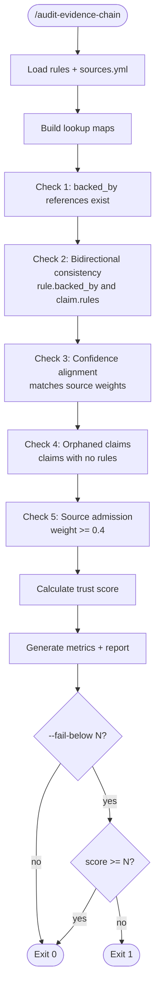

# Evidence Audit Workflow



## Trust Score Calculation

```python
weights = {
    'confirmed': 1.0,    # Official + research validated
    'high': 0.8,         # Official recommendation
    'medium': 0.5,       # Community consensus
    'experimental': 0.2  # Community-only or no backing
}

weighted_sum = sum(max(source.weight for source in rule.backed_by) or 0 for rule in rules)
trust_score = (weighted_sum / len(rules)) * 100
```

## Output Files

| File | Purpose |
|------|---------|
| `.reporails/trust-metrics.yml` | Machine-readable metrics for CI |
| `.reporails/audit-report.md` | Human-readable report (with `--report`) |

## When to Run

- After rule changes (create, update, delete)
- After source changes (new claims, weight updates)
- In CI pipeline (PR checks)
- Before releases (quality gate)
