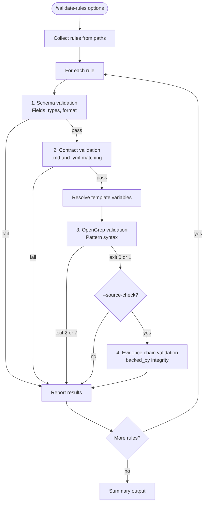

# Rule Validation Workflow



## Template Resolution

Before OpenGrep validation:

1. Load agent config: `agents/{agent}/config.yml`
2. Replace variables from `vars:` section
3. Create temp resolved file for validation

| Template | Example Value (claude) |
|----------|------------------------|
| `{{instruction_files}}` | `**/CLAUDE.md`, `.claude/rules/**/*.md` |
| `{{rules_dir}}` | `.claude/rules` |
| `{{skills_dir}}` | `.claude/skills` |

## Output Format

```
Rules: 42 | Schema errors: 3 | Contract: 1 | Drift: 5
S1: ok  S2: schema error  C1: contract error  E3: drift warning
```
