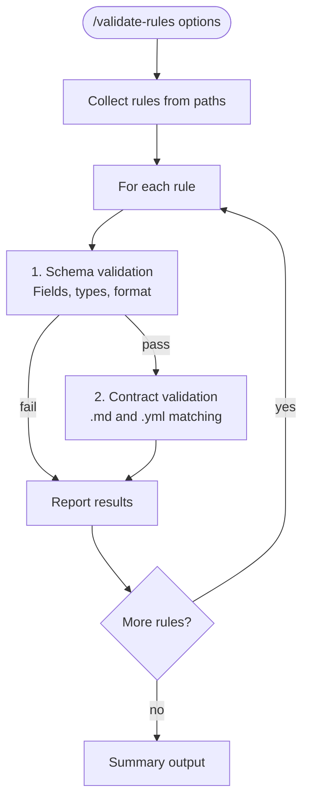

# Rule Validation Workflow


```mermaid
flowchart TD
    START([/validate-rules options]) --> COLLECT[Collect rules from paths]
    COLLECT --> LOOP[For each rule]
    LOOP --> SCHEMA[1. Schema validation<br/>Fields, types, format]
    SCHEMA -->|fail| REPORT
    SCHEMA -->|pass| CONTRACT[2. Contract validation<br/>.md and .yml matching]
    CONTRACT --> REPORT[Report results]
    REPORT --> NEXT{More rules?}
    NEXT -->|yes| LOOP
    NEXT -->|no| SUMMARY[Summary output]
```

## Output Format

```
Rules: 18 | Schema errors: 0 | Contract errors: 0
S1: ok  S2: ok  C1: ok  ...
```
