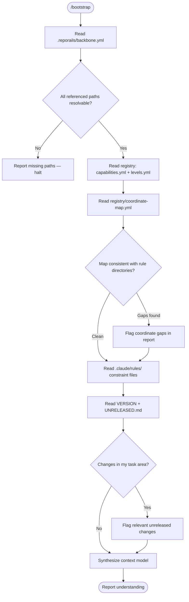

# Bootstrap Workflow



## Key Decision: Why Backbone Loads First

Every other file in the project is located via backbone. The registry path, the schema paths, the rule category directories, the agent configs — all are backbone keys. Loading registry before backbone would mean hardcoding paths like `registry/capabilities.yml` instead of resolving `backbone.registry.capabilities`. This works today but breaks the moment a path moves.

Backbone-first also establishes the project's topology in one read: what agents exist, what rule categories exist, what schemas are defined. This is the mental model the agent needs before touching anything else.

## Key Decision: Why Synthesis, Not Counts

The old bootstrap reported tallies: "98 rules indexed", "6 capabilities loaded". These are metrics about files, not understanding about the project.

An agent that knows "98 rules indexed" still doesn't know:
- How to resolve `CORE:S:0001` to a filesystem path
- Which skill to use for testing vs validation
- What constraints are active for the current task
- Whether unreleased changes overlap with its work area

Synthesis produces a **working context** — the coordinate resolution chain, the operation map (which skill does what), and the constraint list. The agent can reason from this without re-reading files or guessing at paths.

## Key Decision: Path Resolution Chain

The bootstrap must establish the coordinate → path resolution chain explicitly:

```
Coordinate (e.g., CORE:S:0001)
  → coordinate-map.yml → slug (e.g., root-instruction-file-exists)
  → backbone.rules.categories.{category} → base path (e.g., core/structure/)
  → backbone.rules.patterns.rule_dir → full path (e.g., core/structure/root-instruction-file-exists/)
```

This chain is the single most important navigation tool. Without it, the agent falls back to `find` and `grep` to locate rules — exactly what the backbone was designed to prevent.

## Edge Cases

**Backbone version mismatch:**
If `backbone.version` doesn't match what the skill expects, report the mismatch but continue. The backbone format is stable; version drift usually means new keys, not changed ones.

**Missing UNRELEASED.md:**
Not an error — the file may not exist if nothing has changed since the last release. Skip the unreleased section of the report.

**Branch not matching VERSION:**
Common during development. Report both the branch name and VERSION value so the agent knows whether it's working on released or unreleased code.

## Constraints

- MUST read backbone before any other file — no hardcoded paths
- MUST resolve all registry/schema paths from backbone keys
- MUST report the coordinate resolution chain, not just rule counts
- MUST list active constraints from `.claude/rules/`
- MUST flag coordinate-map gaps rather than silently ignoring them
