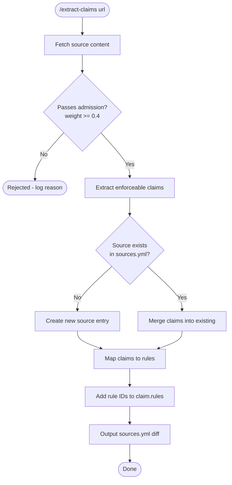

# Claim Extraction Workflow



## Admission Check

| Type | Weight | Pass? |
|------|--------|-------|
| Official | 1.0 | ✓ |
| Research | 0.8-0.9 | ✓ |
| Methodology | 0.6 | ✓ |
| Community | 0.4-0.5 | ✓ |
| Below 0.4 | < 0.4 | ✗ Reject |

**Auto-reject if:**
- Anonymous or unverifiable author
- No specific claims (vague advice only)
- Single anecdote without supporting data

## Claim Extraction Rules

**Extract claims that are:**
- Specific ("Keep under 300 lines")
- Measurable ("No more than 5 emphases")
- Actionable ("Use @imports for...")
- Enforceable (can write a rule for it)

**Skip claims that are:**
- Vague ("Keep it short")
- Opinion without threshold ("Be concise")
- Context-dependent without criteria

## Merge Logic

When source already exists:

```
For each new claim:
  If claim.id exists:
    Update text if changed
    Preserve existing rules[]
  Else:
    Add new claim
```

## Output Format

```yaml
# Add to docs/sources.yml under appropriate section

- id: source-id
  url: "https://..."
  type: official|research|community|methodology
  weight: 1.0
  claims:
    - id: claim-id
      text: "The specific claim"
      quote: true|false
      section: "Section Name"
      rules: [S1, C2]
```

## Edge Cases

**Source is a PDF:**
- Extract text first
- Note page numbers in section field

**Source has no clear sections:**
- Use paragraph numbers or "Introduction", "Body", "Conclusion"

**Claim spans multiple paragraphs:**
- Summarize, set `quote: false`

**Claim contradicts existing source:**
- Flag for manual review
- Do not auto-merge