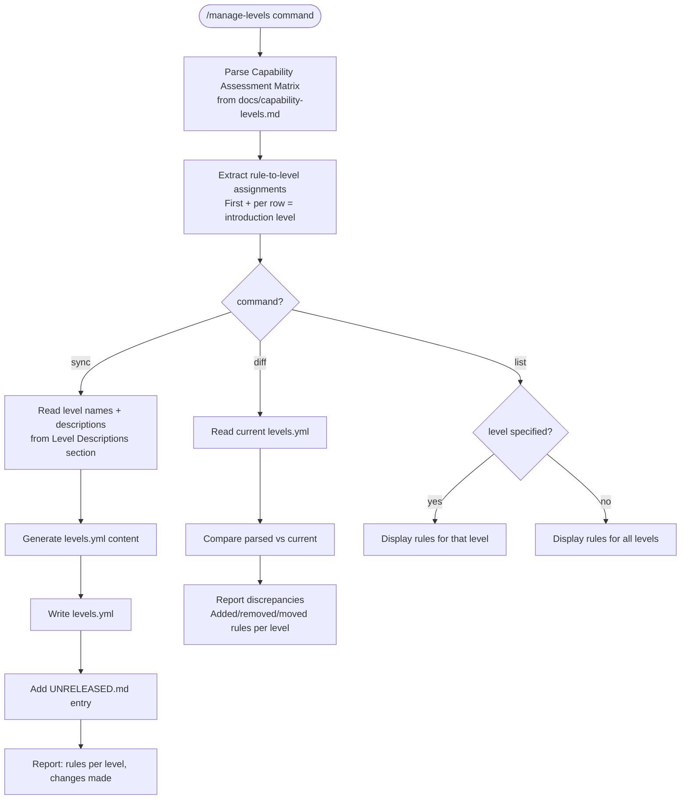

# Level Sync Workflow



## Parsing Contract

The matrix in `docs/capability-levels.md` under "Capability Assessment Matrix":

```markdown
| Criteria | Rule | L1 | L2 | L3 | L4 | L5 | L6 |
|----------|------|----|----|----|----|----|----|
| Manually reviewed | CLAUDE_M1 | + | + | + | + | + | + |
| Size limits | S1 | - | + | + | + | + | + |
```

- **Column 2** = Rule ID
- **Columns 3-8** = L1 through L6 (`+` = required, `-` = not expected)
- **Introduction level** = first column where `+` appears

## Assignment Logic

Each rule is assigned to exactly one level: the **first** level where `+` appears.

Example: `S1` has `- | + | + | + | + | +` — first `+` is L2, so S1 belongs to L2.

`levels.yml` lists only introduction-level rules per level (not cumulative).

## Output Format (levels.yml)

```yaml
# Canonical level definitions for the Reporails framework.
# Source of truth: docs/capability-levels.md (Capability Assessment Matrix)
#
# CLI consumers should prefer this file over any bundled copy.

levels:
  L0:
    name: Absent
    description: No instruction file
    rules: []

  L1:
    name: Basic
    description: <from Level Descriptions>
    rules: [RULE_A, RULE_B]
```

- L0 is always present with empty rules
- Level names and descriptions come from the "Level Descriptions" section headings and content
- Rules are listed in matrix row order (top to bottom)

## Constraints

- **Source of truth**: `docs/capability-levels.md` — never edit `levels.yml` directly
- **Idempotent**: Running `sync` twice produces identical output
- **No reordering**: Rules listed in the order they appear in the matrix
