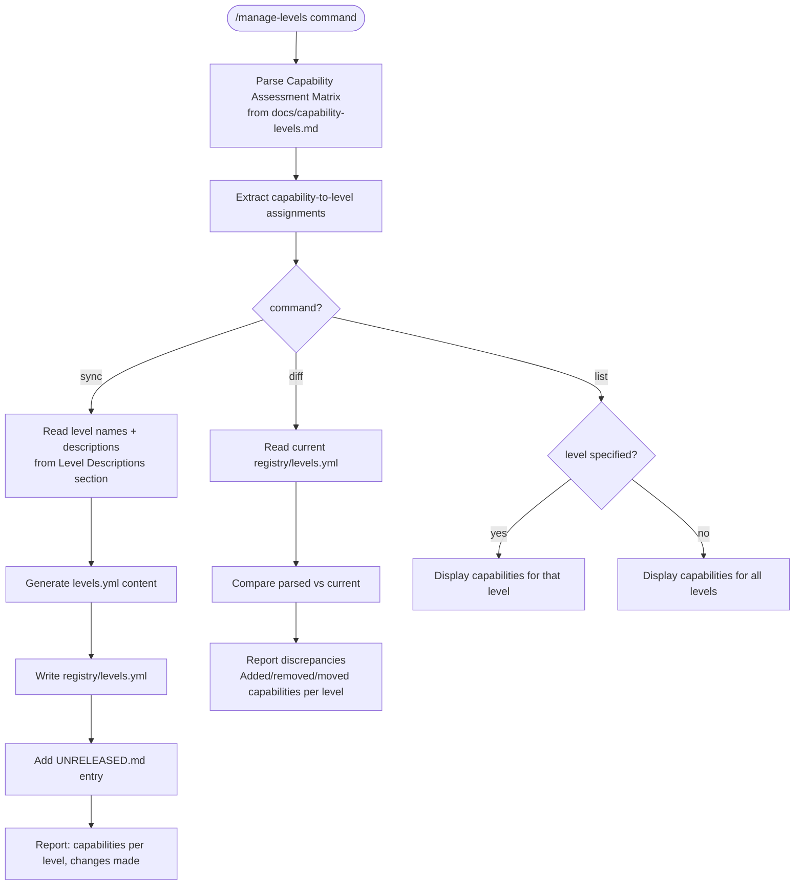

# Level Sync Workflow


```mermaid
flowchart TD
    START([/manage-levels command]) --> PARSE[Parse Capability Assessment Matrix<br/>from docs/capability-levels.md]
    PARSE --> EXTRACT[Extract capability-to-level assignments]
    EXTRACT --> MODE{command?}
    MODE -->|sync| READ_META[Read level names + descriptions<br/>from Level Descriptions section]
    READ_META --> GENERATE[Generate levels.yml content]
    GENERATE --> WRITE[Write registry/levels.yml]
    WRITE --> CHANGELOG[Add UNRELEASED.md entry]
    CHANGELOG --> REPORT_SYNC[Report: capabilities per level, changes made]
    MODE -->|diff| READ_CURRENT[Read current registry/levels.yml]
    READ_CURRENT --> COMPARE[Compare parsed vs current]
    COMPARE --> REPORT_DIFF[Report discrepancies<br/>Added/removed/moved capabilities per level]
    MODE -->|list| FILTER{level specified?}
    FILTER -->|yes| SHOW_ONE[Display capabilities for that level]
    FILTER -->|no| SHOW_ALL[Display capabilities for all levels]
```

## Parsing Contract

The matrix in `docs/capability-levels.md` under "Capability Assessment Matrix":

```markdown
| Capability | Level | What It Detects |
|------------|-------|-----------------|
| instruction_file | L1 | Non-trivial, tracked instruction file exists |
| project_constraints | L2 | Project-specific substance |
| size_controlled | L2 | Instruction file is concise |
```

- **Column 1** = Capability identifier (snake_case)
- **Column 2** = Level where capability is assigned (L1–L6)
- **Column 3** = Detection description

## Assignment Logic

Each capability is assigned to exactly one level.

Example: `project_constraints` is in the L2 row, so it belongs to L2.

`registry/levels.yml` groups capabilities by level.

## Output Format (levels.yml)

```yaml
# Level definitions
version: 1

levels:
  L0:
    name: Absent
    description: "No instruction file exists"
    capabilities: []

  L1:
    name: Basic
    description: "A non-trivial, tracked instruction file exists"
    capabilities:
      - instruction_file

  L2:
    name: Scoped
    description: "Project-specific constraints defined, file is focused"
    capabilities:
      - project_constraints
      - size_controlled
```

- L0 is always present with empty capabilities
- Level names and descriptions come from the "Level Descriptions" section
- Capabilities are listed in matrix row order

## Constraints

- **Source of truth**: `docs/capability-levels.md` — never edit `registry/levels.yml` directly
- **Idempotent**: Running `sync` twice produces identical output
- **No reordering**: Capabilities listed in the order they appear in the matrix
