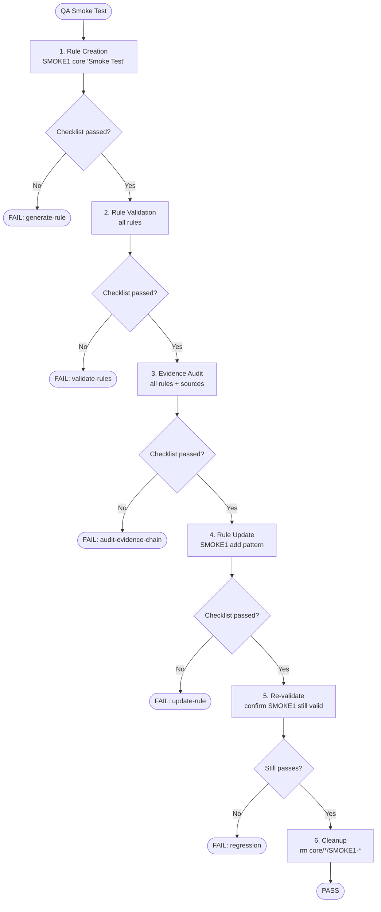

# QA Smoke Test Workflow

Meta-workflow that validates all skill workflows after structural changes.



## Test Sequence

| Step | Workflow | Input | Verify With |
|------|----------|-------|-------------|
| 1 | rule-creation | `SMOKE1 core "Smoke Test"` | qa-checklist.md#generate-rule |
| 2 | rule-validation | all rules | qa-checklist.md#validate-rules |
| 3 | evidence-audit | all rules + sources | qa-checklist.md#audit-evidence-chain |
| 4 | rule-update | `SMOKE1 "Add test pattern"` | qa-checklist.md#update-rule |
| 5 | rule-validation | all rules | SMOKE1 still passes |
| 6 | cleanup | `rm core/*/SMOKE1-*` | files deleted |

## When to Run

- After changes to `.shared/workflows/`
- After changes to `.shared/knowledge/`
- After changes to `.claude/skills/`
- Before merging PRs that touch skill infrastructure

## Edge Cases

**Step 1 fails (generate):**
- Check `.shared/workflows/rule-creation.md` links
- Check `.shared/knowledge/` files exist
- Check skill imports resolve

**Step 4 fails (update):**
- Check rule-update workflow handles existing files
- Verify SMOKE1 was created correctly in step 1

**Step 5 fails (regression):**
- Update broke something — compare .yml before/after
- Check OpenGrep validation output

## Cleanup on Failure

If any step fails, still run cleanup:

```bash
rm -f core/*/SMOKE1-*
```

Don't leave test artifacts in the repo.