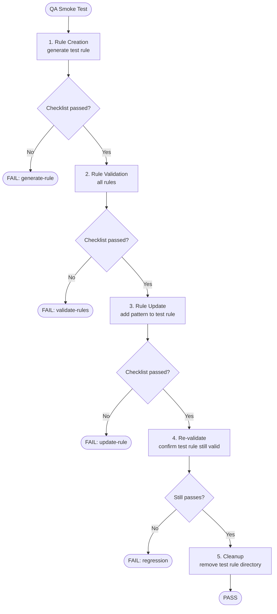

# QA Smoke Test Workflow

Meta-workflow that validates all skill workflows after structural changes.


```mermaid
flowchart TD
    START([QA Smoke Test]) --> GEN[1. Rule Creation<br/>generate test rule]
    GEN --> CHECK1{Checklist passed?}
    CHECK1 -->|No| FAIL1([FAIL: generate-rule])
    CHECK1 -->|Yes| VAL[2. Rule Validation<br/>all rules]
    VAL --> CHECK2{Checklist passed?}
    CHECK2 -->|No| FAIL2([FAIL: validate-rules])
    CHECK2 -->|Yes| UPD[3. Rule Update<br/>add pattern to test rule]
    UPD --> CHECK3{Checklist passed?}
    CHECK3 -->|No| FAIL3([FAIL: update-rule])
    CHECK3 -->|Yes| REVAL[4. Re-validate<br/>confirm test rule still valid]
    REVAL --> CHECK4{Still passes?}
    CHECK4 -->|No| FAIL4([FAIL: regression])
    CHECK4 -->|Yes| CLEANUP[5. Cleanup<br/>remove test rule directory]
    CLEANUP --> PASS([PASS])
```

## Why This Sequence

The five steps form a progressive confidence chain — each step depends on the previous one succeeding and exercises a different workflow:

1. **Create** exercises `rule-creation` — can we produce a valid rule from scratch?
2. **Validate all** exercises `rule-validation` — does the new rule coexist with existing rules without breaking anything?
3. **Update** exercises `rule-update` — can we modify a rule in place without corrupting it?
4. **Re-validate** is the regression gate — did the update break what creation built? This catches the class of bugs where an update workflow silently damages fields that the creation workflow set correctly.
5. **Cleanup** ensures the test is self-contained — no artifacts leak into the real rule set.

Skipping step 4 would miss regression bugs. Skipping step 2 would miss cross-rule conflicts. The order mirrors the lifecycle of a real rule: create, validate, modify, re-validate.

## Why Cleanup Must Always Run

Test artifacts (the `CORE:S:9999` smoke test rule) would pollute real validation runs, appear in coordinate map checks, and confuse git status. Even if step 3 fails, the directory from step 1 still exists. Unconditional cleanup prevents stale test rules from accumulating.

## Test Sequence

| Step | Workflow        | Input                                            | Verify With                    |
|------|-----------------|--------------------------------------------------|--------------------------------|
| 1    | rule-creation   | `/generate-rule CORE:S:9999 structure "Smoke Test"` | qa-checklist.md#generate-rule  |
| 2    | rule-validation | all rules                                        | qa-checklist.md#validate-rules |
| 3    | rule-update     | `/update-rule CORE:S:9999 "Add test pattern"`    | qa-checklist.md#update-rule    |
| 4    | rule-validation | all rules                                        | Test rule still passes         |
| 5    | cleanup         | `rm -rf core/structure/smoke-test/`              | directory deleted              |

## When to Run

- After changes to `.shared/workflows/`
- After changes to `.shared/knowledge/`
- After changes to `.claude/skills/`
- Before merging PRs that touch skill infrastructure

## Edge Cases

**Step 1 fails (generate):**
- Check `.shared/workflows/rule-creation.md` links
- Check `.shared/knowledge/` files exist
- Check skill imports resolve

**Step 3 fails (update):**
- Check rule-update workflow handles existing files
- Verify test rule was created correctly in step 1

**Step 4 fails (regression):**
- Update broke something — compare rule.yml before/after
- Check OpenGrep validation output

## Cleanup on Failure

If any step fails, still run cleanup:

```bash
rm -rf core/structure/smoke-test/
```

Don't leave test artifacts in the repo.
