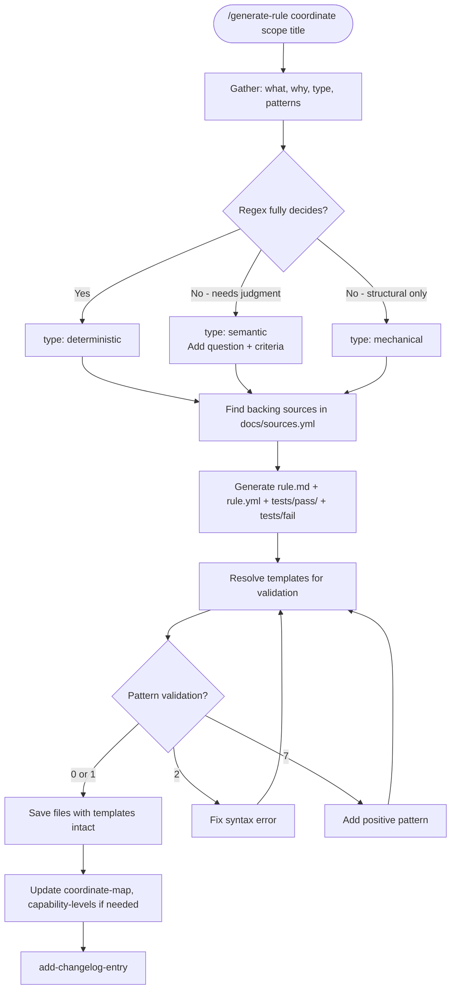

# Rule Creation Workflow

## Why Type Classification Comes First

The type decision (mechanical / deterministic / semantic) sets the ceiling on what detection methods a rule can use:

- **Mechanical** rules check structural facts — file exists, line count thresholds, section presence. No pattern matching. These are the cheapest to run and the most reliable, but can only detect what's countable or locatable.
- **Deterministic** rules use regex patterns to match or reject content. They can detect specific textual violations without human judgment. Most rules land here.
- **Semantic** rules require an LLM judgment call — the violation can't be reduced to a pattern. These are the most expensive and least deterministic, so they're a last resort, not a default.

Choosing the type early prevents over-engineering (writing regex patterns for a rule that only needs `file_exists`) or under-engineering (trying to pattern-match something that genuinely needs judgment).

## Why Sources Before Generation

Every rule must reference at least one entry in `docs/sources.yml`. This is not bureaucracy — it's the evidence chain. A rule without a backing source is an arbitrary opinion. Sources ground rules in published best practices, official documentation, or empirical research, which makes the framework defensible when users ask "why does this rule exist?"

If no existing source covers the rule, a new source entry must be added first. The rule and its justification enter the system together.

## Why Validate Before Save

The resolve → validate loop catches broken patterns before they're committed. A rule that passes schema validation but has malformed pattern syntax would fail silently until someone runs the test harness — possibly much later, in a different context. Validating at creation time makes the failure immediate and attributable.

## Edge Cases

**No existing source backs the rule:**
- Add a new source entry to `docs/sources.yml` with the URL, type, and weight
- Then reference its ID in the rule's `backed_by` list

**Core vs Agent rules:**
- Core rules use only `{{instruction_files}}`
- Agent rules can use `{{rules_dir}}`, `{{skills_dir}}`, etc.

**Path resolution:** Resolve rule paths from `.reporails/backbone.yml` using `rules.categories`, `rules.agent_rules`, and `rules.patterns`.
See [@.shared/knowledge/backbone-resolution.md](../knowledge/backbone-resolution.md) for the coordinate-to-path algorithm and directory structure.
