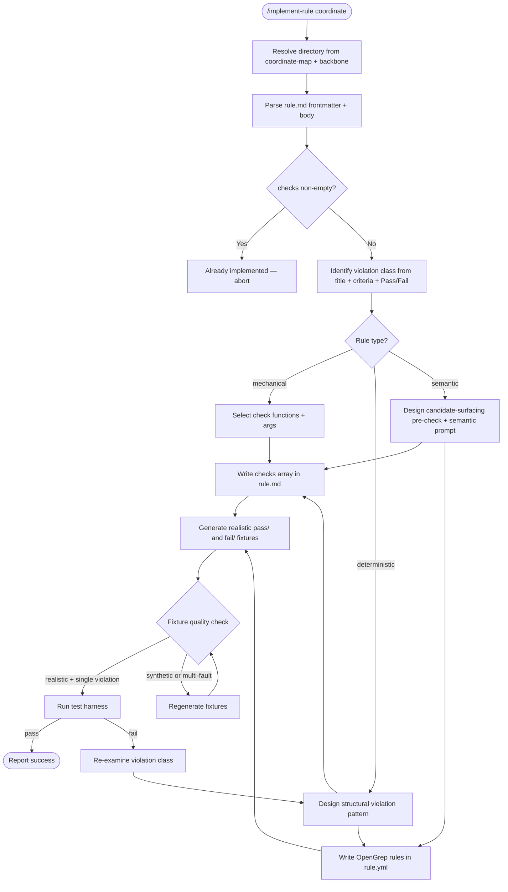

# Rule Implementation Workflow

## Key Decision: Violation Class Identification

Before designing any pattern, answer these questions:

1. **What structural or content pattern makes an instruction file FAIL this rule?**
   - The Pass/Fail examples in rule.md are illustrations, not specifications
   - Think about the CLASS of violation, not the specific example

2. **Is this a presence-of-bad-content or absence-of-good-content violation?**
   - Presence: pattern matches the violation directly
   - Absence: pattern matches the structural gap left by the missing content
   - NEVER use negate-based presence checks as the primary strategy

3. **For semantic rules: what text NEEDS human judgment?**
   - Pre-checks surface content that EXHIBITS the violation pattern
   - Not content that MATCHES the rule's topic

## Edge Cases

**Rule already has checks:**
Abort with message — do not overwrite existing implementation.

**Semantic rules with existing `question`/`criteria`:**
Use those fields directly for the terminal semantic check `prompt`. Invert `criteria` items to derive pre-check violation indicators. Do not invent new evaluation criteria.

**Agent-specific rules (CLAUDE:\*, CODEX:\*):**
Use agent-specific template vars in paths (e.g., `{{rules_dir}}`, `{{skills_dir}}`). Resolve from `agents/{agent}/config.yml`.

**Cross-file rules:**
Set `cross_file: true` on the deterministic check. Fixture must contain multiple files in `tests/pass/` and `tests/fail/` to exercise cross-file behavior.

**Mechanical-only rules:**
Leave `rule.yml` as `rules: []` — no OpenGrep patterns needed. Fixtures must exercise the mechanical check function (e.g., file presence/absence for `file_exists`).

**Deterministic rules with mechanical pre-checks:**
Allowed — `deterministic` type ceiling permits both `mechanical` and `deterministic` checks. Order them so mechanical runs first if it narrows the target set.

**Absence-type violations with no structural signature:**
When the violation is purely "keyword X is missing" and no structural gap pattern exists, `negate: true` is acceptable as a last resort. Document why in the check's `message` field. Use OpenGrep's `patterns` (combined `pattern-regex` + `pattern-not-regex`) over frontmatter `negate` where possible — it keeps the logic in the pattern engine rather than the test runner.

## Fixture Quality Criteria

| Criterion | Pass fixture | Fail fixture |
|-----------|-------------|-------------|
| Length | 30-80 lines (realistic) | 30-80 lines (realistic) |
| Content | Looks like a real CLAUDE.md | Looks like a plausible mistake |
| Violations | Zero for this rule | Exactly one specific violation |
| Structure | Has sections, commands, context | Same structure, one thing wrong |
| Realism | Could be from a real project | Someone would actually write this |
