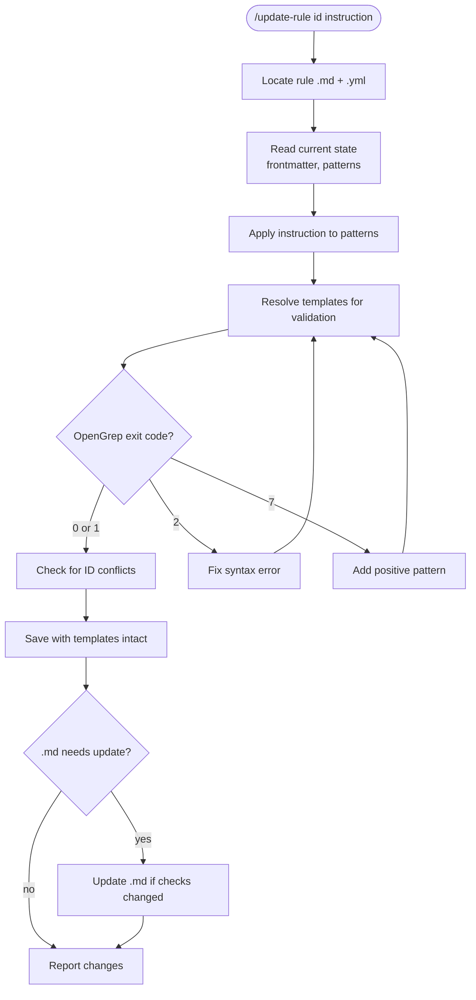

# Rule Update Workflow



## Constraints

**NEVER change:**
- Rule ID (e.g., S6 stays S6)
- Filenames (e.g., S6-yaml-backbone.yml stays S6-yaml-backbone.yml)
- Category or type

**Save with templates:**
- Write `{{instruction_files}}` not resolved values
- Resolution is only for validation

## File Locations

```
Core rules:    core/{category}/{ID}-*.md and .yml
Agent rules:   agents/{agent}/rules/{ID}-*.md and .yml
```
