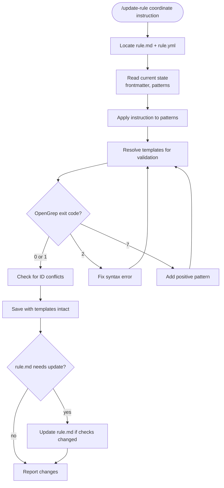

# Rule Update Workflow

```mermaid
flowchart TD
    START([/update-rule coordinate instruction]) --> LOCATE[Locate rule.md + rule.yml]
    LOCATE --> READ[Read current state<br/>frontmatter, patterns]
    READ --> APPLY[Apply instruction to patterns]
    APPLY --> RESOLVE[Resolve templates for validation]
    RESOLVE --> VALID{OpenGrep exit code?}
    VALID -->|0 or 1| CONFLICT[Check for ID conflicts]
    VALID -->|2| FIX2[Fix syntax error] --> RESOLVE
    VALID -->|7| FIX7[Add positive pattern] --> RESOLVE
    CONFLICT --> SAVE[Save with templates intact]
    SAVE --> SYNC{rule.md needs update?}
    SYNC -->|yes| UPDATEMD[Update rule.md if checks changed]
    SYNC -->|no| REPORT
    UPDATEMD --> REPORT[Report changes]
```

## Why Coordinates and Slugs Are Immutable

Rule coordinates (e.g., `CORE:S:0005`) and directory slugs are external references. Other rules, changelogs, documentation, and the coordinate map all point to them. Renaming a coordinate would silently break every reference and create phantom entries in the registry.

If a rule's scope changes enough to warrant a new coordinate, tombstone the old one and create a new rule.

## Why Templates Must Survive the Save

The resolve → validate → save cycle has a critical invariant: **stored files contain templates, never resolved values**.

Templates like `{{instruction_files}}` make rules portable across agents. A core rule resolved for Claude (`**/CLAUDE.md`) would fail for Codex (`codex.md`). Resolution is ephemeral — it exists only for validation. Saving resolved values would lock a rule to a single agent's configuration.

## Why the Fix Loop Exists

OpenGrep exit codes signal distinct problems:

- **Exit 2** (syntax error): The pattern itself is malformed. Fix the YAML/regex and re-validate.
- **Exit 7** (no positive pattern): OpenGrep requires at least one positive match to anchor the rule. Add a `pattern` or `pattern-regex` before retrying.
- **Exit 0 or 1** (valid): Pattern is syntactically correct regardless of whether it matched anything.

The loop prevents saving patterns that would fail at runtime in the test harness.

## Constraints

**NEVER change:**
- Rule coordinate (e.g., `CORE:S:0005` stays `CORE:S:0005`)
- Directory slug (e.g., `instruction-file-size-limit/` stays `instruction-file-size-limit/`)
- Category or type

**Save with templates:**
- Write `{{instruction_files}}` not resolved values
- Resolution is only for validation

## Path Resolution

Resolve rule paths from `.reporails/backbone.yml` using `rules.categories` and `rules.patterns`.
See [@.shared/knowledge/backbone-resolution.md](../knowledge/backbone-resolution.md) for the coordinate-to-path algorithm.
