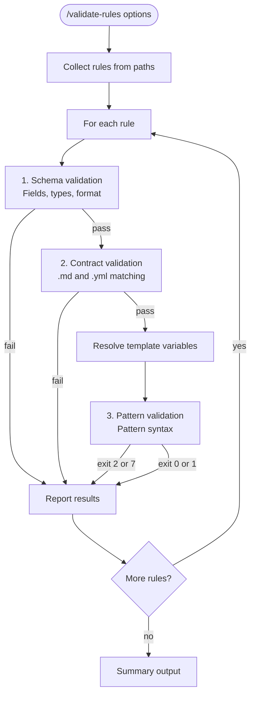

# Rule Validation Workflow



## Why Three Layers in This Order

Validation runs schema, then contract, then pattern validation. The ordering is deliberate:

1. **Schema validation** catches structural errors (missing fields, wrong types, bad format) with zero external dependencies. It's the cheapest check and filters out rules that would cause confusing downstream failures.

2. **Contract validation** confirms that `rule.md` and `rule.yml` agree — same coordinate, matching check IDs, consistent type declarations. This catches the class of bugs where one file was updated but the other wasn't. It requires both files to be schema-valid first.

3. **Pattern validation** runs the actual patterns against the syntax checker. This is the most expensive step and requires template resolution (file I/O, agent config loading). Running it last means we only pay that cost for rules that are already structurally sound.

Reversing the order would waste time running pattern validation on rules with missing fields, or mask contract errors behind pattern syntax failures.

## Why Template Resolution Happens Before Pattern Validation Only

Schema validation checks the template syntax itself — `{{instruction_files}}` must appear as-is in the stored file. Resolving templates before schema validation would hide template errors.

The pattern engine, however, needs real glob paths to validate pattern syntax. A pattern targeting `{{instruction_files}}` is not a valid path — it must be resolved to `**/CLAUDE.md` (or equivalent) before the pattern engine can parse it.

## Template Resolution

Before pattern validation:

1. Load agent config: `agents/{agent}/config.yml`
2. Replace variables from `vars:` section
3. Create temp resolved file for validation

| Template                | Example Value (claude)                  |
|-------------------------|-----------------------------------------|
| `{{instruction_files}}` | `**/CLAUDE.md`, `.claude/rules/**/*.md` |
| `{{rules_dir}}`         | `.claude/rules`                         |
| `{{skills_dir}}`        | `.claude/skills`                        |

## Output Format

```
Rules: 42 | Schema errors: 3 | Contract: 1 | Drift: 5
S1: ok  S2: schema error  C1: contract error  E3: drift warning
```
