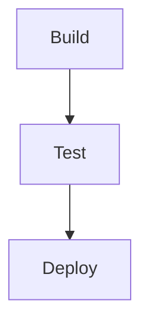

# Instruction File Contains Mermaid Diagram Blocks To Visualize Workflows, State Machines, Or Decision Flows

Instruction files SHOULD mermaid diagrams are parseable by both humans and agents — they encode workflow logic more precisely than prose descriptions

## Pass / Fail

### Pass

````
# Workflow
The deployment pipeline follows these steps:

````

### Fail

````
# Workflow Overview
The pipeline has multiple steps and decision points.
````

## Limitations


